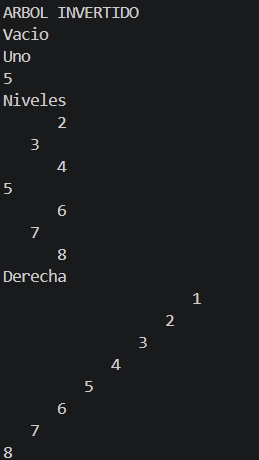
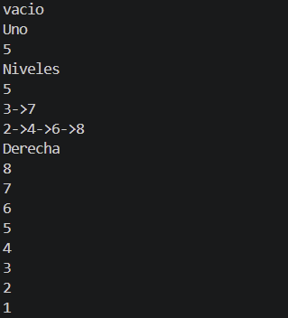
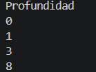

# Práctica: Imprecion de estrucuras no lineales tipo arbol

## Datos del Estudiante
- **Nombre:** [Oliver Alejandro Valdiviezo Arévalo]
- **Curso:** [1°]
- **Fecha:** [17/06/2026]

---
# 1. Implementacion de estructuras no lineales

**Fecha:** [17 de Junio de 2026]

**Descripcion:**

Creamos lo basico de las estructuras no lieneales de tipo arbol con los diferentes metodos esceciales de esta clase, como agregar un nodo, de forma ordenada, como crear este tipo de clase y como al final quedaria ya armado el arbol

**Fecha:** [19 de Junio de 2026]

**Descripcion:**

Finalizamos la clase IntTree con los ultimos metodos, obtener el peso, la altura y como es la optimizacion de tiempo, mientras menos tiempo mas memoria se usa, tambien creamos la clase Persona y Binary tree, la cual esta basada complentamente en el IntTree pero esta es una clase generica que funciona con cualquier tipo de variable, tambien para poder hacerlo implementamos el metodo comparteTo para poder comparar los valores de forma generica, finalmente implementamos tambien eso a la clase Persona para que esta no de errores.

**Fecha:** [22 de Junio de 2026]

**Descripcion:**

Empezamos a hacer diferentes ejercios los cuales sirven para comprender como funcionan los metodos recursivos en los arboles.

Lo que hicismo fue crear 4 clases ejercicios:

- Ejerciocio1: 

La funcionalidad de esta clase es simplemente le damos una lista de numeros y con eso hacer un arbol binario con un for e imprimirlo de forma horizontal con un nuevo metodo de imprecion que es una variacion del metodo preOrder el cual va viendo el nivel en el que esta el nodo y va a imprimiendo los saltos de linea necesarios con otro for.

- Ejercicio2:

En este ejercicio tenemos como parametro el nodo root/raiz y debemos de invertir los nodos del arbol, podemos hacer esto gracias a una variacion de los metodos order que nos sirven para imprimir, en vez de imprimir al entrar al nodo debemos de cambiar este nodo con el cotrario (el del otro extremo), gracias al metodo postOrder que con este envez de un "sout" le ponemos un return. Algo extra es coger el metodo de ejercicio 1 para poder imprimirlo y visualizarlo.

- Ejercicio3:

En este ejercicio debemos de poder obtener una lista de listas las cuales tengan los nodos separados en listas, una mejor forma de verlo es en niveles, la lista tiene posisciones y la lista principal tiene listitas que serian los niveles del arbol que en ellas tienen los nodos de ese nivel, para poder hcaer esto debemos de hacer un metodo el cual su base recursiva no de nada, tenga un if para validar en que si se puede añadir otro nivel extra o no, porque dependiendo de que valor salga no va a ser igual el nivel y el tamaño de la listota, despues lo agregamos a su respectivo nivel y finalmente usamos este metodo recursivo para poder llegar a todos los nodos, este metodo recursivo necesita 3 parametros, el Nodo actual, int que seria el nivel y la listota donde vamos a agregar los niveles y nodos.

- Ejercicio4

Este ejercicio nos pide ver la profundidad maxima de un arbol con el nodo raiz, este metodo solamente necesita el nodo raiz y con este hacemos el metodo recursivo el cual simplemente hacemos una variacion del metodo postOrder en el cual creamos variables int de la profundidad izquierda y derecha, las cuales nos ayudaran a llegar al fondo del estas (cuando lleguen a null) y al final un "return 1 + el mayor entre ambos" el 1 es para que cada vez que bajen mas en los nodos consideren cada bajada que hacen, porque cada vez que bajan 1 vez seria uno de profundidad extra.

## Imprecion De Los Ejerciocios
### Ejercicio1

### Ejercicio2

### Ejercicio3

### Ejercicio4
